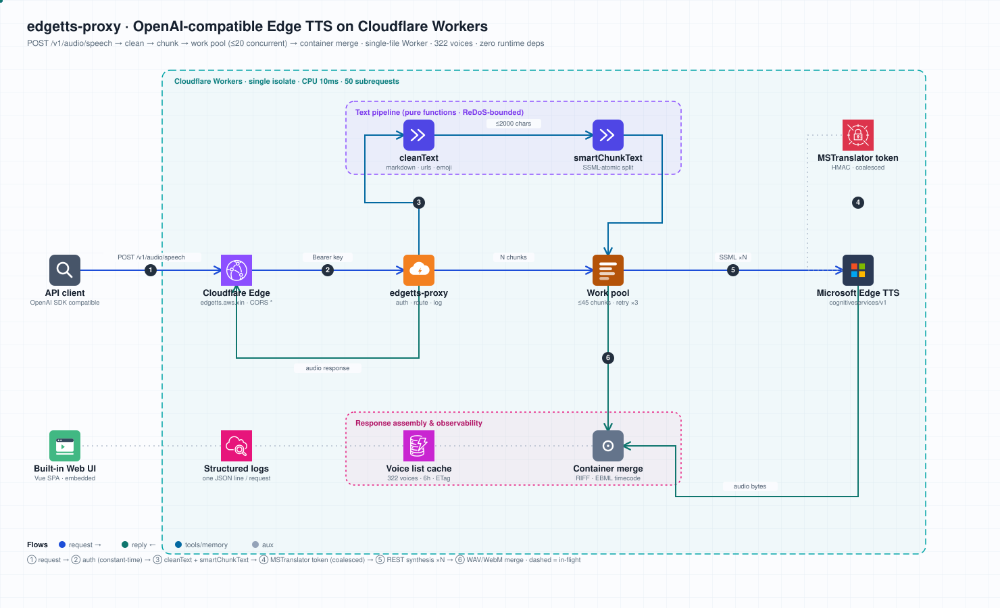
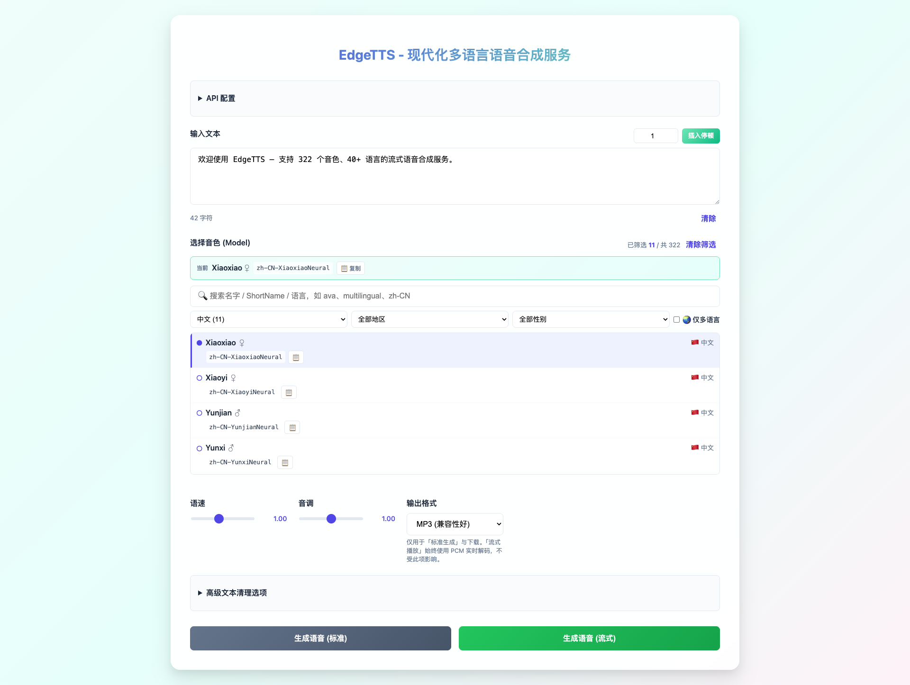
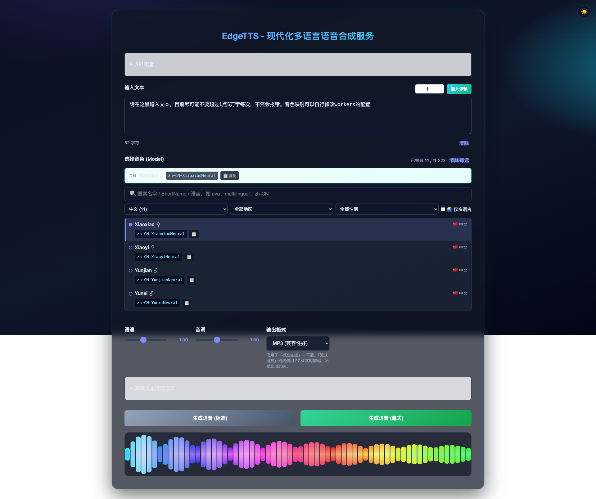

<p align="center">
  
</p>

<h1 align="center">edgetts-ws-worker</h1>

[](https://github.com/neosun100/edgetts-ws-worker/actions/workflows/ci.yml)
[](https://workers.cloudflare.com)
[](#api)
[](LICENSE)

**[English](README.md)** · **[路线图](ROADMAP.md)** · **[更新日志](CHANGELOG.md)**

一个 Cloudflare Worker，把微软 Edge / Azure TTS 封装成一套**兼容 OpenAI** 的语音合成
API —— 支持真流式播放、322 个音色、内置 Web UI，零运维。无服务器、全球边缘、免费额度友好。

> **在线服务：** [edgetts.aws.xin](https://edgetts.aws.xin) —— 直接用网页，或 `POST /v1/audio/speech`。



## 特性

- 🎙️ **322 个音色，40+ 语言** —— 微软全部神经网络音色，含多语言音色。
- ⚡ **真流式** —— 用 `response_format: "pcm"` 时首个分块即可开播并完整播到结束
  （MP3 等容器格式无法边收边播，详见[流式说明](#流式)）。
- 🧩 **兼容 OpenAI** —— `POST /v1/audio/speech`，可直接替换 OpenAI TTS。
- 🚀 **并发合成** —— 长文本按句分块，滑动窗口并发合成后**保序**下传。线上实测：600 字符
  切成 12 块，串行 3683ms、并发 10 时 918ms —— **4.0 倍**提速，且各并发档位输出逐字节相同。
- 🌍 **全球边缘** —— 跑在 Cloudflare 300+ 节点，单请求 CPU < 1ms。
- 🖥️ **内置 Web UI** —— Worker 自身托管的 Vue 单页应用。
- 🔓 **开放设计** —— 宽松 CORS、不限流；仅用 API key 作门槛。

## Web 界面

浏览器打开 `/`。322 个音色可按语言、地区、性别、「仅多语言」逐层筛选，也可直接搜名字 /
ShortName。每个音色都展示完整 `ShortName` 并带一键复制，方便直接粘进 API 调用。
选择器是标准的 **radio group**：方向键 / Home / End 移动并选中、Enter 与空格确认、焦点环
可见 —— 322 个音色全部可键盘到达，读屏也会正确播报当前选择。播放时绘制
三层声纹 —— **Siri 风格环形律动** + 每个音节起音的**粒子迸发** + **滚动脉冲波形**
（每个音节沿时间轴前进）。右上角可切换**亮色 / 暗夜**主题（记忆到本地）。

配色**由音频本身决定**，不是随机变色：色相跟随谱质心（低频元音→琥珀，高频擦音→青），
饱和度跟随谱峰均比（浊音浓郁、噪声发灰），亮度跟随音量，并按音色基频给整段一个稳定的
色相偏移 —— 低音音色永远比高音音色更暖。所有阈值都用真实 TTS 音频的实测分布标定。




<p align="center"><em>暗夜主题</em></p>



## 快速开始

### 使用托管实例

```bash
curl -X POST https://edgetts.aws.xin/v1/audio/speech \
  -H 'Authorization: Bearer YOUR_KEY' \
  -H 'Content-Type: application/json' \
  -d '{"input":"你好，来自边缘节点！","voice":"zh-CN-XiaoxiaoNeural"}' \
  --output speech.mp3
```

### 自行部署

```bash
git clone https://github.com/neosun100/edgetts-ws-worker
cd edgetts-ws-worker
npm run build                    # 打包 ui/ + src/ → dist/worker.js
npx wrangler secret put API_KEY  # 设置密钥（或设 ALLOW_ANONYMOUS=true 开放访问）
npx wrangler deploy
```

无需安装依赖 —— 构建与测试只用 Node 内置能力。

## API

### `POST /v1/audio/speech`

```jsonc
{
  "input": "要合成的文本。",       // 必填，长度上限见下文
  "voice": "zh-CN-XiaoxiaoNeural", // 或 OpenAI 别名：alloy/echo/fable/onyx/nova/shimmer
  "speed": 1.0,                     // 0.25–4.0
  "pitch": 1.0,                     // 0.5–1.5
  "style": "general",              // 表达风格
  "response_format": "mp3",        // mp3 | opus | wav（pcm 为流式内部使用）
  "stream": false,                  // true → 裸音频流
  "cleaning_options": { }           // 合成前清理 markdown/emoji/url 等
}
```

返回对应 `Content-Type` 的音频字节。出错时返回 JSON `{ "error": { message, code, type, param } }`，
`code` 精确（如 `invalid_voice`、`invalid_response_format`、`input_too_long`）。

`param` 指出出错的请求字段（`voice`、`speed`、`cleaning_options.custom_keywords`，body 本身
解析不了时是 `body`），没有单一字段可归因时为 `null`。它有必要是因为有两个 code 各服务两种
原因：`invalid_request_error` 既是「body 不是 JSON」也是「input 缺失」，
`invalid_cleaning_options` 既是容器类型错也是嵌套字段类型错 —— code 为了兼容既有调用方保持
不变，靠 `param` 区分。

<a name="流式"></a>
#### 流式

设 `stream: true`，服务端会按分块到达的顺序流式下传，格式就是你请求的那个。

**流式请务必用 `response_format: "pcm"`。** 容器格式（MP3/Opus/WAV）无法增量解码：部分
MP3 会被当成一个「完整的短片段」播完即停 —— 这正是本项目最初要解决的 1.67 秒截断。服务端
**不会**替你改写格式，你请求什么就下传什么。内置 Web UI 会在发送流式请求前自动把格式改成
`pcm`，并用 Web Audio API 在连续时间轴上播放，因此立即开播、不会截断；直接调 API 的调用方
需要自己做这个选择。

流式请求若会切成多块，`wav` 与 `opus` 会被拒绝并返回 400 `stream_format_not_chunkable`。
它们是带头部的容器格式：第二块到达时响应头早已发出，既无法把多个容器合成一个、也无法回填
长度。放任不管的结果是 200 响应里首个头声明 61.46s、而实际含 191.67s —— 播放器在 32% 处停止。
流式请用 `pcm`，或去掉 `stream` 拿一个已合并的文件。

非流式请求则返回正常的 MP3/Opus/WAV 文件。

### `GET /v1/models` · `GET /v1/models/public`

以类 OpenAI-models 结构列出全部音色（322 个）。两个端点接受相同的查询过滤：

- `?multilingual=true` —— 只返回多语言音色（322 个里的 12 个）。
- `?neural=true` —— 为兼容既有调用方而保留，但是个 **no-op**：上游所有音色本身都是
  Neural 音色，过滤不掉任何东西。

列表在进程内缓存 6 小时，并带 `Cache-Control: public, max-age=21600`，重复调用不再穿透上游。
上游故障时返回最后一次成功的列表（并打 warn 日志），而不是直接失败。

### `GET /`

返回内置 Web UI。

## 输出格式

| `response_format` | Content-Type | 流式 | 说明 |
|---|---|---|---|
| `mp3` | audio/mpeg | 非流式 | 默认，兼容性最好 |
| `opus` | audio/webm | 非流式 | 高压缩；分块会被合并（见下） |
| `wav` | audio/wav | 非流式 | 无损，体积大 |
| `pcm` | audio/pcm | **流式** | 流式自动使用；不是 UI 选项 |

> 不支持 AAC 与 FLAC —— 上游端点会返回 400 拒绝。

**多分块 opus 会被合并成单个 WebM 段。** 上游对每个分块返回一个完整独立的容器，而
`<audio>` 只认第一个 —— 用真实分块实测：文件含 94.56s 音频，元素只报 9.44s，静默丢掉
最多 90%。现在 Worker 会把各容器的 Cluster 时间戳改写成一条连续时间轴（45 块约 1.2ms；
上游的封装恰好省掉了所有需要回填长度的元素，因此没有任何 size 字段要动）。若某块不是可解析
的 WebM，则放弃合并、原样透传字节，并把原因记进日志。

合并结果还会带上顶层 `Duration`，因此 `<audio>.duration` 与 `seekable` 在
`loadedmetadata` 时就可用 —— 进度条一开始就正常，拖动也准确，不必先拖到末尾。线上实测：
4 分块请求的 `duration = 191.7`，直接拖到 150s 落在 150.00。

## 配置

| 变量 | 类型 | 用途 |
|---|---|---|
| `API_KEY` | secret | `/v1/audio/speech` 所需的 Bearer 令牌。**未设置时 Worker 返回 503**，而非无鉴权放行。 |
| `ALLOW_ANONYMOUS` | var | 设为 `"true"` 以明确开放访问（无需 key）。 |

### 长度上限

请求体上限 256KB（413 `payload_too_large`），`input` 上限 50000 字符（400 `input_too_long`）。

**真正的约束是分块数，不是字符数。** 文本按 `chunk_size` 切块，每块消耗一次上游
subrequest，而 Cloudflare 单次调用只允许 50 次。因此超过 45 块会被拒绝并返回 413
`too_many_chunks` —— 默认 `chunk_size=300` 时约合 13500 字符。

要合成更长的文本，把 `chunk_size` 调大（上限 2000，约合 9 万字符），或拆成多次请求。
块越粗则上游调用越少越长：首字节略慢，但余量大得多。

这个校验刻意放在写出任何响应字节**之前**：流式请求一旦超出平台预算，旧行为是
HTTP 200 + 格式完好的 EOF，调用方无法区分被截断的音频和完整音频。

## 开发

```bash
npm test              # 单元 + 集成 + 回归（Node 内置 runner，零依赖）
npm run coverage      # 带行覆盖率
npm run build         # ui/ + src/ → dist/worker.js
npm run dev           # wrangler dev
```

详见 [CONTRIBUTING.md](CONTRIBUTING.md)。测试分层于 `test/`（unit/integration/regression/e2e）；
handler 测试对着 mock 上游跑，因此离线且确定。E2E 测试打真实服务，除非设 `EDGETTS_E2E=1` 否则跳过。

## 工作原理

1. **鉴权 + 校验** —— 常数时间校验 API key，再逐项校验参数，任一不符返回精确错误码。
2. **清理 + 分块** —— 可选文本清理，按句分块使单次请求不超上游上限。
3. **令牌** —— 获取并缓存微软 speech 令牌（JWT），到期前刷新；并发刷新合并为一次。
4. **合成** —— 每块生成 SSML 请求（voice/style/prosody 安全转义）；滑动窗口并发、保序下传，
   上游瞬时失败自动重试。

## 配套与遗留

- `legacy/worker-ndjson.js` —— 最初的 WebSocket + NDJSON 版本，也是**逐词时间戳**
  （`WordBoundary`）的**唯一来源**。这个能力无法合并进主 worker：词边界只存在于 WebSocket
  协议，而出站 WebSocket 只能跑在 `*.workers.dev`（自定义域名下 CF 代理层会破坏握手）。
  实测用多种 header 组合请求 REST 端点，返回的都是纯音频、零时间戳字段。所以需要时间戳
  （如逐词高亮）时请调 legacy 部署：

  ```bash
  curl -X POST https://edgetts-ws-worker.neosun808.workers.dev/ \
    -H 'Content-Type: application/json' \
    -d '{"input":"你好世界","voice":"zh-CN-XiaoxiaoNeural"}'
  # -> { audio: "<base64 mp3>", timestamps: [{ text, offset, duration }, ...] }
  ```

  其契约由 `test/e2e/legacy-timestamps.test.mjs` 锁定。完整分析见 [ROADMAP](ROADMAP.md)。
- [edgetts-ws](https://github.com/neosun100/edgetts-ws) —— 同思路的 Python 服务端版本。

## 许可

MIT
